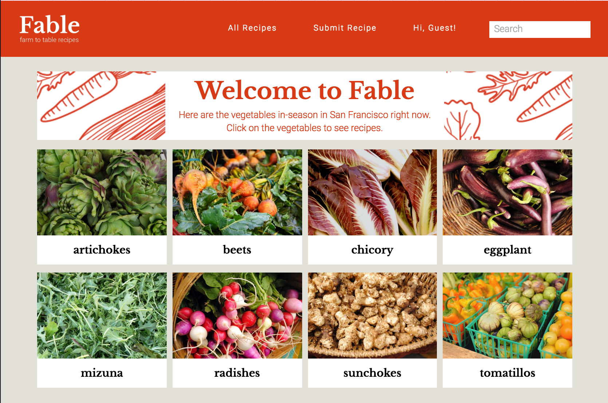
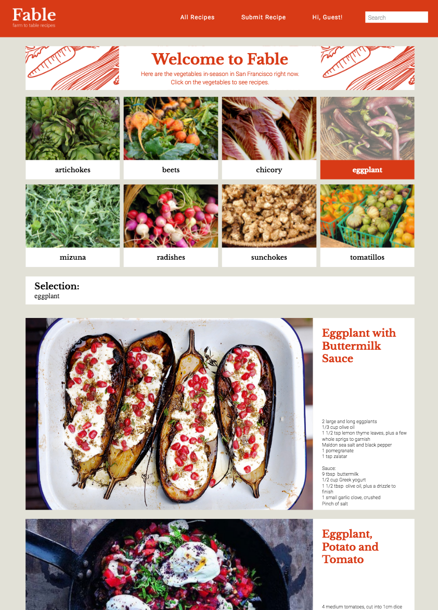
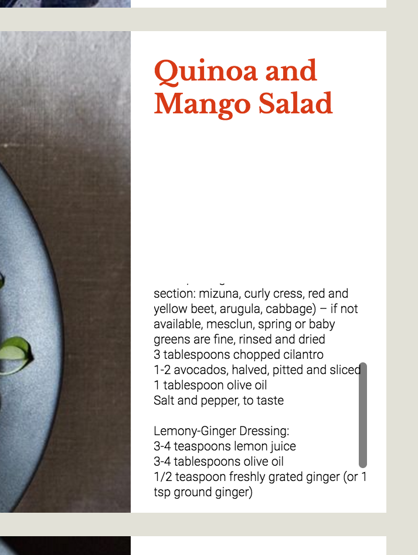
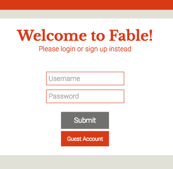

[live](http://www.fablefood.com)

##### Fable provides you with recipes for vegetables that are currently in-season in the Bay Area.

##### Sign up to comment and add new recipes to the site.

##### It's built on a Postgres/Rails/React stack, so it's solid, easily extendable, and highly efficient in your browser.

# Features & Implementation

## Vegetables
Fable filters through all the vegetables in its database to give you the vegetables that are currently in-season this month:

Below is the process for filtering the vegetables:
``` javascript
  vegetables && Object.keys(vegetables).map(
    (vegObjectId) => {
      const month = Date().split(" ")[1].toLowerCase();
      const veg = vegetables[vegObjectId];
      if (veg[month] === true) {
        return (this.renderVegItem(veg));
      }
    })
```
## Recipes
You can click on these vegetables to select recipes that contain those ingredients.


To implement this selection, I created a handle to add the selected vegetables into state and then using that to render all the matching recipes
``` javascript
handleClick(vegId) {
  const vegArr = this.state.selectedVegIds.concat([vegId]);
  this.setState({selectedVegIds: vegArr}, () => {
    this.props.queryRecipes(this.state.selectedVegIds);
  });
}
```
These recipes cards show a preview of the recipe, with a scrollable ingredients preview:


## Log in/Sign up
To submit a new recipe or to comment on a recipe, login is required:


On the backend, password data is protected:
```ruby
def password=(password)
  @password = password
  self.password_digest = BCrypt::Password.create(password)
end

def is_password?(password)
  BCrypt::Password.new(self.password_digest).is_password?(password)
end
```
